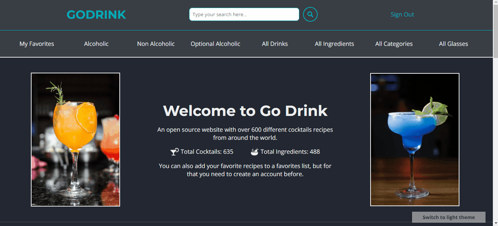
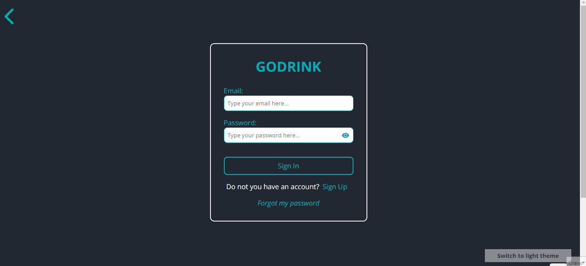

<h1 align="center">🍹 Go Drink 🍸</h1>

 

 <a href="#demo">Demonstração</a> •
 <a href="#tecnologias">Tecnologias</a> •
  <a href="#funcionalidades">Funcionalidades</a> •
 <a href="#detalhes">Detalhes</a> •
 <a href="#footer">Rodapé</a>

É um site que fornece mais de 600 receitas de coquetéis do mundo todo, utilizando <a href="https://www.thecocktaildb.com/api.php">The CocktailDB API</a>. Possui tema dark e você ainda pode listar suas bebidas favoritas.

<h4 align="center">
  <a href="https://go-drink.vercel.app/">Clique para visitar o site!</a> -
  <a href="https://github.com/MatheusAndrade23/GoDrink_Backend">Clique para ver o Backend!</a>
</h4>

---

<h2 id="demo">Demonstração 🎥</h2>

_<h3>Um pequeno tour pelo Projeto 🚀</h3>_

_<h3>Adicionando aos favoritos ⭐</h3>_

_<h3>Pesquisando 🔎</h3>_

_<h3>Autenticando 👤</h3>_

 

---

<h2 id="tecnologias">Tecnologias Utilizadas 🛠</h2>

#### FrontEnd: `NextJS!`

- Next SEO
- Flag Icons
- React Icons
- Axios
- Styled Components
- React Elastic Carousel
- Context API
- React Hooks
- React Toastify

#### BackEnd: `NodeJS!`

- Express
- Express-Handlebars
- JWT
- Bcrypt
- Mongoose
- Nodemon
- Nodemailer
- DotEnv
- Cors

#### Banco de Dados: `MongoDB-Atlas!`

 
  
  
  
  
  
  
  
   
  
 

  

---

<h2 id="funcionalidades">Funcionalidades ⚙️</h2>

- ✔️ Responsivo
- ✔️ Ferramenta de pesquisa
- ✔️ Mudança de Tema
- ✔️ Recuperação de Senha
- ✔️ Lista de favoritos
- ✔️ Ver detalhes da Bebida Escolhida
- ✔️ Listagem de tipos de Copos, Categorias e Ingredientes
- ✔️ Listagem de bebidas baseada em Categorias, Ingredientes e tipos de Copos

 

---

<h2 id="detalhes">Alguns Detalhes do Funcionamento do Projeto 🔎</h2>

_<h3>Autenticação 👤</h3>_

#### A autenticação do usuário é baseada em tokens, utilizando <a href="https://www.npmjs.com/package/jsonwebtoken">Json Web Token</a> para gerar e verificar a validade de um token através de um middleware no backend. Além disso, existe um provider dedicado à essa funcionalidade no frontend, que contém todos os métodos (Conectar, Registrar e Sair) e armazena o token e os dados do usuário no local storage.

##

_<h3>Mudança de Tema 🎨</h3>_

#### A aplicação conta com dois temas (claro e escuro), e um botão para a mudança fixo na tela. O tema escuro é renderizado por padrão, mas o tema escolhido pelo usuário fica salvo no local storage sem a necessidade de criar uma conta.

---

🌟 Se você gostou, por favor considere dar uma estrela! 🌟

